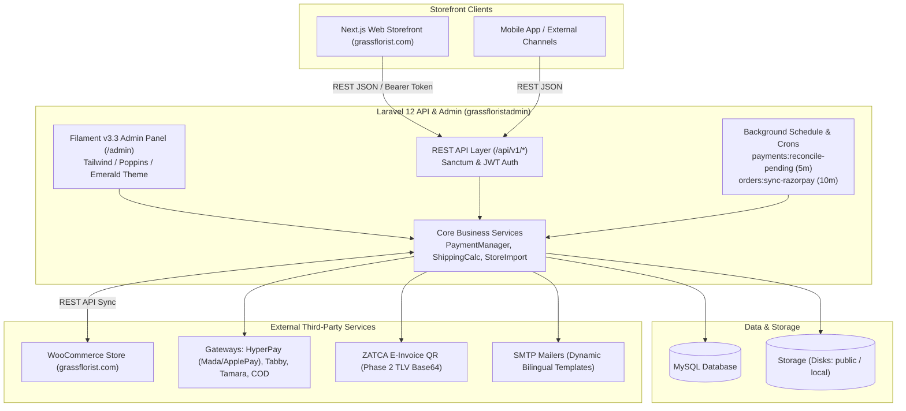

# Grass Florist - Comprehensive Codebase Overview & System Architecture

> **Purpose:** Ye document pooray codebase ka single source of truth hai. Jab bhi project ka overview, module details, ya code structure chahiye ho, toh saari files scan karne ki zaroorat nahi hai—is document ko refer karein.
> **Last Updated:** October 2026  
> **Tech Stack:** Laravel 12.x (PHP 8.2+) | Filament v3.3 | Livewire 3 / Volt | MySQL | REST APIs (Next.js Headless Frontend)

---

## Table of Contents
1. [Executive Summary & Business Domain](#1-executive-summary--business-domain)
2. [System Architecture & Technology Stack](#2-system-architecture--technology-stack)
3. [Directory Layout & File Structure](#3-directory-layout--file-structure)
4. [User Roles, RBAC & Multi-Vendor Engine](#4-user-roles-rbac--multi-vendor-engine)
5. [Saudi Arabia Localization & ZATCA Compliance](#5-saudi-arabia-localization--zatca-compliance)
6. [Catalog & Product Architecture (Bilingual)](#6-catalog--product-architecture-bilingual)
7. [Orders, Invoicing & Luxury Gift Card Engine](#7-orders-invoicing--luxury-gift-card-engine)
8. [Payment Infrastructure, Webhooks & Auto-Recovery Cron](#8-payment-infrastructure-webhooks--auto-recovery-cron)
9. [Shipping & Dynamic Delivery Slots Engine](#9-shipping--dynamic-delivery-slots-engine)
10. [Abandoned Cart Recovery Workflow](#10-abandoned-cart-recovery-workflow)
11. [WooCommerce Synchronization Engine](#11-woocommerce-synchronization-engine)
12. [Headless Storefront REST API Directory (Complete 45+ Endpoints)](#12-headless-storefront-rest-api-directory-complete-45-endpoints)
13. [Interactive Swagger & OpenAPI API Documentation](#13-interactive-swagger--openapi-api-documentation)
14. [Scheduled Jobs & Artisan Console Commands](#14-scheduled-jobs--artisan-console-commands)
15. [Database Models & Relationship Matrix](#15-database-models--relationship-matrix)
16. [Quick Navigation & File Reference Index](#16-quick-navigation--file-reference-index)
17. [Enterprise Standards: UI, Icons & Code Hygiene](#17-enterprise-standards-ui-icons--code-hygiene)

---

## 1. Executive Summary & Business Domain
**Grass Florist** (`grassflorist.com`) Saudi Arabia (KSA) aur GCC market ke liye luxury online flower, gift, aur cakes delivery platform hai.
- **Backend & Admin Panel:** Laravel 12 + Filament v3 (`/admin`) jisme Super Admin, Multi-Vendor Portal, Staff Permissions, aur Catalog Management shamil hain.
- **Headless Storefront Integration:** Next.js frontend ke sath REST API integration (`/api/v1/*`).
- **Primary Market:** Saudi Arabia (Currency: SAR, Language: English + Arabic RTL, 15% ZATCA VAT, Friday prayer schedule shift delivery slots).

---

## 2. System Architecture & Technology Stack



### Core Dependencies (`composer.json`):
- **PHP:** `^8.2`
- **Laravel Framework:** `^12.0`
- **Admin Panel:** `filament/filament: ^3.3`
- **Livewire & Volt:** `livewire/flux: ^2.0`, `livewire/volt: ^1.7.0`
- **Authentication:** `laravel/sanctum: ^4.0`, `tymon/jwt-auth: ^2.3`
- **OpenAPI & Swagger Engine:** `dedoc/scramble: ^0.13`
- **PDF & Reports:** `barryvdh/laravel-dompdf: ^3.1`, `maatwebsite/excel: ^3.1`, `pxlrbt/filament-excel: ^2.4`
- **Payment SDKs:** `razorpay/razorpay: ^2.9` + Custom REST integrations (HyperPay, Tabby, Tamara)
- **Menu Builder:** `biostate/filament-menu-builder: ^1.0`
- **Analytics:** `flowframe/laravel-trend: ^0.4.0`

---

## 3. Directory Layout & File Structure

```
grassfloristadmin/
├── app/
│   ├── Console/Commands/       # 11 Artisan commands (Sync, Crons, Abandoned Carts)
│   ├── Enums/                  # OrderStatusEnum, ProductTypeEnum
│   ├── Filament/               # Admin panel core
│   │   ├── Pages/              # CommissionSettings, ApiDocumentation, Auth Customizations
│   │   ├── Resources/          # 31 Filament Resources (CRUDs & Views)
│   │   └── Widgets/            # Dashboard stats, Order charts, Vendor stats
│   ├── Http/
│   │   ├── Controllers/Admin/  # Printable orders (Gift Card, ZATCA Tax Invoice)
│   │   ├── Controllers/Api/    # 28 API Controllers (Storefront, Cart, Checkout, Webhooks)
│   │   └── Middleware/         # CustomerAuth, VendorAuth, Cors
│   ├── Mail/                   # 15 Mailable classes (Bilingual emails, order status, vendor alerts)
│   ├── Models/                 # 35 Eloquent Models (Order, Product, Vendor, Customer, etc.)
│   ├── Observers/              # OrderObserver (auto-email on status change), UserObserver
│   ├── Providers/              # AdminPanelProvider, CustomerAuthProvider, etc.
│   ├── Services/               # Core business services
│   │   ├── Payments/           # PaymentManager, HyperPay, Tabby, Tamara
│   │   ├── CartService.php     # Session & customer cart synchronization
│   │   ├── ShippingCalculationService.php # Weight slabs & COD surcharge logic
│   │   └── StoreImportService.php         # WooCommerce 2-way sync engine
│   ├── Traits/                 # HasTranslations (JSON English/Arabic column handler)
│   └── helpers.php             # Currency formatting, RTL detection, translation fallback
├── config/                     # Application configurations (filament, services, scramble, auth, jwt, etc.)
├── database/
│   ├── migrations/             # 61 Database migrations
│   └── seeders/                # Seeders (DeliverySlots, Gateways, Templates)
├── resources/
│   └── views/
│       ├── prints/             # gift_card.blade.php (A6 6x4), tax_invoice.blade.php (ZATCA)
│       ├── pdf/                # order.blade.php (DomPDF invoice)
│       ├── swagger.blade.php   # Standalone Swagger UI 5.x documentation view
│       └── filament/           # Custom blade templates for Filament
├── routes/
│   ├── api.php                 # REST API endpoints for Next.js storefront & webhooks
│   ├── web.php                 # Admin redirects, PDF/Print routes, Swagger route
│   └── console.php             # Scheduled cron jobs (payments:reconcile-pending, razorpay)
└── storage/                    # Public uploads, logs, cache, temp exports
```

---

## 4. User Roles, RBAC & Multi-Vendor Engine

Model: `App\Models\User.php` | Vendor Model: `App\Models\Vendor.php`

### Roles:
1. **`admin` (Super Administrator):**
   - Full access across all sections, settings, and financial reports.
   - Vendor approval/suspension, global commission configuration, and system management.
2. **`vendor` (Multi-Vendor Marketplace Seller):**
   - Access restricted: `canAccessPanel()` tabhi allow karta hai jab `is_active = 1` aur `vendor.approval_status = 'approved'`.
   - Data Scoping: Vendor sirf apne products, apne orders (`order_items.vendor_id`), aur apni payout reports dekh sakta hai.
   - Payout & Commission Formula:
     $$\text{Gross Amount} \rightarrow \text{Commission Fee (\%)} \rightarrow 18\% \text{ GST on Fee} \rightarrow \text{Net Payout}$$
3. **`team` (Staff Members):**
   - Array-based permissions (`User::$permissions` JSON column):
     `['orders', 'products', 'abandoned_carts', 'reports', 'settings', ...]`.
   - `User::hasPermission('slug')` check ke zariye granular access control.

---

## 5. Saudi Arabia Localization & ZATCA Compliance

Project GCC aur Saudi Arabia ke strict e-commerce guidelines ke mutabiq configured hai:

1. **Currency Management (`app/helpers.php`):**
   - Default Currency: **SAR** (Saudi Riyal).
   - Functions: `currency_symbol()`, `currency_code()`, `format_currency($amount)`.
2. **Bilingual Translation Engine (`App\Traits\HasTranslations`):**
   - Database columns me JSON store hota hai: `{"en": "Luxury Red Roses", "ar": "ورود حمراء فاخرة"}`.
   - Admin UI me tabbed layout (English input LTR & Arabic input RTL).
   - Helper function `format_translatable($value, $locale)` auto fallback handle karta hai.
3. **ZATCA Simplified Tax Invoice (`/orders/{id}/tax-invoice`):**
   - Blade view: `resources/views/prints/tax_invoice.blade.php`.
   - Saudi 15% VAT automatic breakdown: Subtotal, Shipping VAT, Item VAT, TRN (Tax Registration Number).
   - Dynamic ZATCA QR Code (Phase 2 compliant TLV Base64 format: Seller Name, VAT Number, Timestamp, Total with VAT, VAT Total).
4. **Tracking Pixels (`App\Models\GlobalSetting`):**
   - Admin se direct inject hote hain: Google Analytics (GA4), Google Tag Manager (GTM), Meta Pixel, TikTok Pixel, Snapchat Pixel.

---

## 6. Catalog & Product Architecture (Bilingual)

Model: `App\Models\Product.php` | Resource: `App\Filament\Resources\ProductResource.php`

- **Translations:** `name`, `sub_title`, `description`, `meta_tag_title`, `meta_tag_description`, `meta_tag_keywords`.
- **Slugs:** English slug (`slug`) + Arabic slug (`slug_ar`).
- **Categories:** Multi-category support via `category_product` pivot table (`belongsToMany(Category::class)`).
- **Vendor Link:** `vendor_id` nullable (Null = In-house admin product, Set = Vendor specific).
- **Customer Visibility Scope (`scopeVisibleToCustomers`):**
  - Product `is_visible == 1`.
  - Agar vendor product hai, toh vendor `approval_status == 'approved'` aur vendor user `is_active == 1` hona lazmi hai.
- **Images:** Primary thumbnail (`image`) + Gallery array (`gallery` JSON).

---

## 7. Orders, Invoicing & Luxury Gift Card Engine

Model: `App\Models\Order.php` | Resource: `App\Filament\Resources\OrderResource.php`

### Order Statuses (`App\Enums\OrderStatusEnum`):
- `new`, `pending`, `processing`, `order_shipped`, `completed`, `declined`, `cancelled`, `refunded`.
- Status change hone par `App\Observers\OrderObserver` automatically customer ko notification email bhejta hai (`OrderStatusUpdatedMail`).

### Special Florist Fields:
- Delivery Slot & Date: `delivery_date`, `delivery_time`.
- Gifting Metadata: `sender_name`, `recipient_name`, `recipient_phone`, `delivery_message`.
- Multimedia Links:
  - `song_link`: Customer Spotify / YouTube song QR code gift card par print karne ke liye.
  - `location_link`: WhatsApp / Google Maps pin location driver ke liye.
- Financials: `subtotal`, `discount_amount`, `tax_amount`, `shipping_amount`, `delivery_amount`, `total_amount`.

### 3 Dedicated Printable Views:
1. **Luxury Florist Gift Card (`/orders/{id}/gift-card`):**
   - Standard 6"x4" (A6 landscape postcard) size.
   - Arabic Calligraphy & English luxury typography.
   - Song Link ka automatic QR Code generator (Spotify play).
   - Zero pricing / Zero financial details (Receiver gift presentation).
2. **ZATCA Tax Invoice (`/orders/{id}/tax-invoice`):**
   - Official Saudi B2C invoice with QR code and bilingual line items.
3. **Downloadable PDF Invoice (`/orders/{id}/pdf`):**
   - DomPDF engine formatted receipt with order barcode.

---

## 8. Payment Infrastructure, Webhooks & Auto-Recovery Cron

Manager: `App\Services\Payments\PaymentManager.php`  
Table: `payment_gateways`, `payment_logs`

### Supported Payment Providers:
| Gateway Code | Channel / Features | Service Class | Notes |
|---|---|---|---|
| `hyperpay` | Mada, Apple Pay, Visa/Mastercard, STC Pay | `HyperPayService.php` | Server-to-server Copyandpay / Widget |
| `tabby` | Buy Now Pay Later (4 split installments) | `TabbyService.php` | Webhook + Session verification |
| `tamara` | Buy Now Pay Later (3/4 split installments) | `TamaraService.php` | Webhook + Checkout session |
| `cod` | Cash On Delivery | Native logic | Optional 15 SAR fee via `extra_fee` |
| `razorpay` | Card, Netbanking, UPI | `RazorpayService.php` | Legacy/supplementary integration |

### 5-Minute Auto-Recovery Cron (`payments:reconcile-pending`):
- Command: `App\Console\Commands\ReconcilePendingPayments`
- Schedule: `routes/console.php` (`everyFiveMinutes()->withoutOverlapping()`).
- Background cron gateway APIs se verify karke order ko `payment_status = paid`, `status = processing` mark karta hai aur stock release karta hai.

---

## 9. Shipping & Dynamic Delivery Slots Engine

### Delivery Slots (`App\Models\DeliverySlot.php`):
- **Day Shifts:**
  - **Regular Days (Sat - Thu):** Morning (`11:00 AM - 03:00 PM`) & Evening (`07:00 PM - 10:00 PM`).
  - **Friday Special (Jummah Shift):** After Jummah (`04:00 PM - 07:00 PM`) & Late (`07:30 PM - 10:00 PM`).
- **Real-Time Cutoff:** Agar current time slot ke cutoff se aage nikal chuka ho, toh same-day slot frontend API me automatically disable ho jata hai.

### Shipping Calculation (`App\Services\ShippingCalculationService.php`):
- Flat shipping vs Dynamic weight slab calculation.
- Packaging buffer weight (e.g. +100g buffer parcel weight me judta hai).
- Free shipping threshold evaluation & COD surcharge addition.

---

## 10. Abandoned Cart Recovery Workflow

Model: `App\Models\Cart.php` | Resource: `AbandonedCartResource.php`

1. User cart me items daalta hai aur contact/checkout step par data fill karta hai.
2. Background Command `php artisan carts:check-abandoned` inactive carts ko `status = abandoned` mark karta hai.
3. Filament Admin me Abandoned Carts counter aur badge display hota hai.
4. 1-Click WhatsApp / Email reminder trigger (`AbandonedCartReminderMail`) jisme dynamic cart restoration link aur discount coupon code attach hota hai.
5. Restore endpoint `/api/cart/recover` user ko direct populated checkout page par le aata hai.

---

## 11. WooCommerce Synchronization Engine

Service: `App\Services\StoreImportService.php` (1,180+ lines)

WooCommerce API (`wp-json/wc/v3`) ke sath synchronization logic:
- `php artisan store:import-categories` $\rightarrow$ Categories, slugs, images.
- `php artisan store:import-products` $\rightarrow$ Simple & variable products, attributes, images, stock.
- `php artisan store:import-customers` $\rightarrow$ User accounts, shipping addresses.
- `php artisan store:import-orders` $\rightarrow$ Order items, addresses, statuses.
- `php artisan store:download-images` $\rightarrow$ High-res media files local disk par download karna.
- `php artisan store:sync-all` $\rightarrow$ Full sequential store sync.

---

## 12. Headless Storefront REST API Directory (Complete 45+ Endpoints)

Base Prefix: `/api` & `/api/v1` (`routes/api.php`)

### A. Catalog & Search APIs
| Method | Route / URI | Controller & Action | Parameters / Notes | Auth |
|---|---|---|---|---|
| `GET` | `/api/category` | `CategoryController@index` | Sabhi active categories list | Public |
| `GET` | `/api/category/{slug}` | `ProductController@productsByCategorySlug` | Specific category ke products list | Public |
| `GET` | `/api/products` | `ProductController@index` | Paginated products (sort, price, search) | Public |
| `GET` | `/api/products/{slug}` | `ProductController@show` | Single product detail (bilingual, images, stock) | Public |
| `GET` | `/api/search` | `ProductSearchController@search` | `?q={query}` instant search | Public |
| `GET` | `/api/publications` | `PublicationController@index` | Brand/Vendor publishers list | Public |
| `GET` | `/api/publication/{slug}` | `PublicationController@productsBySlug` | Single publisher products | Public |
| `GET` | `/api/menus/{menuName}` | `MenuController@getMenuItems` | Header & Footer navigation menus | Public |

### B. Cart & Checkout APIs (`/api/cart/*`)
| Method | Route / URI | Controller & Action | Payload / Notes | Auth |
|---|---|---|---|---|
| `GET` | `/api/cart/viewcart` | `CartController@viewcart` | Current cart items, subtotal, discounts | Session |
| `POST` | `/api/cart/add` | `CartController@add` | `{ product_id, quantity, options }` | Session |
| `POST` | `/api/cart/cartupdate` | `CartController@cartupdate` | `{ cart_item_id, quantity }` | Session |
| `POST` | `/api/cart/remove` | `CartController@remove` | `{ cart_item_id }` remove item | Session |
| `POST` | `/api/cart/clear` | `CartController@clear` | Clear entire cart session | Session |
| `GET` | `/api/cart/coupons` | `CheckoutController@getAvailableCoupons` | List valid promotional coupons | Public |
| `POST` | `/api/cart/coupon/{coupon_code}` | `CheckoutController@showCouponCode` | Validate and calculate coupon discount | Public |
| `POST` | `/api/cart/checkout` | `CheckoutController@process` | Finalize checkout & generate order | Session |
| `POST` | `/api/cart/sync-customer` | `CartController@syncCustomer` | Sync guest cart with logged-in customer | Session |
| `POST` | `/api/cart/recover` | `CartController@recover` | `{ token }` abandoned cart restore | Public |
| `POST` | `/api/cart/razorpay/callback` | `CheckoutController@razorpayCallback` | Razorpay payment callback | Public |
| `POST` | `/api/cart/razorpay/webhook` | `CheckoutController@razorpayWebhook` | Direct Razorpay webhook event | Public |
| `POST` | `/api/cart/razorpay/cancel` | `CheckoutController@handlePaymentCancel` | Payment cancellation webhook | Public |

### C. Saudi Payment Gateways & Delivery Slots (`/api/v1/*`)
| Method | Route / URI | Controller & Action | Payload / Query | Auth |
|---|---|---|---|---|
| `GET` | `/api/v1/payment-methods` | `StorefrontPaymentController@getPaymentMethods` | Active gateways list (HyperPay, Tabby, Tamara, COD) with fees & limits | Public |
| `GET` | `/api/v1/delivery-slots` | `StorefrontPaymentController@getDeliverySlots` | `?date=YYYY-MM-DD` (Regular vs Friday Jummah shifts with past-hour cutoffs) | Public |
| `POST` | `/api/v1/payments/initiate` | `StorefrontPaymentController@initiatePayment` | `{ order_id, payment_gateway }` $\rightarrow$ prepares checkout session | Public |
| `POST` | `/api/v1/payments/verify` | `StorefrontPaymentController@verifyPaymentStatus` | `{ order_id, gateway, reference_id }` on-demand frontend verify | Public |
| `POST` | `/api/v1/webhooks/hyperpay` | `PaymentWebhookController@handleHyperPay` | HyperPay server-to-server webhook | Webhook Sig |
| `POST` | `/api/v1/webhooks/tabby` | `PaymentWebhookController@handleTabby` | Tabby BNPL server webhook | Webhook Sig |
| `POST` | `/api/v1/webhooks/tamara` | `PaymentWebhookController@handleTamara` | Tamara BNPL server webhook | Webhook Sig |

### D. Customer Authentication & Account Management
| Method | Route / URI | Controller & Action | Notes | Auth |
|---|---|---|---|---|
| `POST` | `/api/v1/register` | `AuthController@register` | `{ name, email, phone, password }` | Public |
| `POST` | `/api/v1/login` | `AuthController@login` | Returns JWT / Sanctum Bearer token | Public |
| `POST` | `/api/v1/checkuser` | `AuthController@checkuser` | Verify email/phone availability | Public |
| `POST` | `/api/v1/updateuser` | `AuthController@updateuser` | Update name, contact details | Bearer Token |
| `GET` | `/api/my-account/user` | `AuthController@user` | Customer profile details | Bearer (`customer`) |
| `POST` | `/api/my-account/logout` | `AuthController@logout` | Revoke customer auth session | Bearer (`customer`) |
| `POST` | `/api/my-account/passwordchange` | `AuthController@passwordchange` | `{ old_password, new_password }` | Bearer (`customer`) |
| `GET` | `/api/my-account/checkauth` | `AuthController@checkAuth` | Check if token is valid | Bearer (`customer`) |
| `GET` | `/api/my-account/user_order/{user_id}` | `OrderApiController@userOrders` | Customer order history list | Bearer (`customer`) |
| `GET` | `/api/orders/{order_number}` | `OrderApiController@show` | Single order tracking detail | Public / Customer |
| `POST` | `/api/my-account/cancel-order` | `OrderApiController@cancelOrder` | Request order cancellation | Bearer (`customer`) |
| `GET` | `/api/my-account/view-address/{user_id}` | `AuthController@viewAddress` | Saved shipping addresses | Bearer (`customer`) |
| `POST` | `/api/customer/forgot-password` | `CustomerForgotPasswordController@sendResetLinkEmail` | Forgot password email | Public |
| `POST` | `/api/customer/reset-password` | `CustomerResetPasswordController@reset` | Reset password token handler | Public |

### E. Customer Wishlist (`/api/my-account/*`)
| Method | Route / URI | Controller & Action | Notes | Auth |
|---|---|---|---|---|
| `GET` | `/api/my-account/view-wishlist` | `WishlistController@index` | Get customer saved wishlist products | Bearer (`customer`) |
| `GET` | `/api/my-account/view-wishlistid`| `WishlistController@wishlistid` | Get array of saved product IDs | Bearer (`customer`) |
| `POST` | `/api/my-account/add-wishlist` | `WishlistController@store` | `{ product_id }` add to wishlist | Bearer (`customer`) |
| `DELETE`| `/api/my-account/delete-wishlist`| `WishlistController@destroy` | `{ product_id }` remove from wishlist | Bearer (`customer`) |

### F. CMS, Content & Global Settings
| Method | Route / URI | Controller & Action | Notes | Auth |
|---|---|---|---|---|
| `GET` | `/api/home-page` | `HomePageController@index` | Homepage banners, featured products, sliders | Public |
| `GET` | `/api/global-settings` | `GlobalSettingController@index` | Site title, logos, pixels (GA4/Meta/TikTok), VAT % | Public |
| `GET` | `/api/contact-page` | `ContactPageController@index` | Contact details, phone, map cords | Public |
| `GET` | `/api/cms-pages/{slug}` | `CmsPageController@showBySlug` | Content pages (Terms, Privacy, Delivery info) | Public |
| `GET` | `/api/blog` & `/api/blog/{slug}`| `CmsPostController@index / showBySlug` | Blog articles listing & detail | Public |
| `GET` | `/api/news` & `/api/news/{slug}`| `NewsController@index / newsBySlug` | News articles & announcements | Public |
| `GET` | `/api/sitemap-data` | `SitemapController@index` | Dynamic XML sitemap generator feed | Public |
| `GET` | `/api/state-of-india` | `StateController@index` | States/regions list | Public |

### G. Public Form Submissions
| Method | Route / URI | Controller & Action | Notes | Auth |
|---|---|---|---|---|
| `POST` | `/api/contact-form` | `ContactFormController@send` | General contact inquiry form | Public |
| `POST` | `/api/newsletter` | `NewsletterController@subscribe` | Newsletter email subscription | Public |
| `POST` | `/api/product-request` | `ContactFormController@submitProductRequest` | Custom flower arrangement request | Public |
| `POST` | `/api/vendor-form` | `ContactFormController@submitVendorForm` | Vendor inquiry lead form | Public |
| `POST` | `/api/vendor-register` | `VendorRegistrationController@register` | Vendor seller onboarding registration | Public |
| `POST` | `/api/tutor-form` | `ContactFormController@submitTutorForm` | Workshop florist tutor submission | Public |

---

## 13. Interactive Swagger & OpenAPI API Documentation

Project me OpenAPI 3.1 engine (`dedoc/scramble`) aur official Swagger UI live integrate kiya gaya hai.

### Features & Live Access URLs:
1. **Admin Panel Direct Access (`/admin/api-documentation`):**
   - Navigation: `Settings ➔ Swagger API Docs`
   - Page Class: `App\Filament\Pages\ApiDocumentation.php`
   - Embedded view: Filament ke andar hi interactive Swagger UI embed hai jisme "Try it out", request parameter inputs, aur live responses available hain.
   - Switcher: Direct button se **Classic Swagger UI** aur **Modern Elements View** me switch kar sakte hain.
2. **Dedicated Fullscreen Swagger UI (`/docs/swagger`):**
   - Route: `Route::get('/docs/swagger')` (`resources/views/swagger.blade.php`)
   - Official Swagger UI 5.x engine without emojis or double headers when embedded.
   - Deep linking, real-time filtering, cURL generation, aur Authorize token inputs.
3. **Modern Interactive Elements View (`/docs/api`):**
   - Auto-generated OpenAPI playground by Scramble engine.
4. **Raw OpenAPI 3.1 Schema (`/docs/api.json`):**
   - Machine-readable JSON contract jo Postman, Insomnia, ya Next.js client generation me direct import kiya ja sakta hai.

---

## 14. Scheduled Jobs & Artisan Console Commands

Registered in `routes/console.php`:

| Command | Frequency | Description |
|---|---|---|
| `payments:reconcile-pending` | Every 5 Minutes | HyperPay, Tabby, Tamara pending transactions verify & recover |
| `orders:sync-razorpay` | Every 10 Minutes | Sync Razorpay pending payment states |
| `carts:check-abandoned` | Daily / Scheduled | Mark idle active carts as abandoned |
| `store:sync-all` | Manual / CLI | Full WooCommerce catalog and order sync |

---

## 15. Database Models & Relationship Matrix

| Model | Table | Core Relations |
|---|---|---|
| `User` | `users` | `hasOne(Vendor)`, role (`admin`, `vendor`, `team`) |
| `Vendor` | `vendors` | `belongsTo(User)`, `hasMany(Product)`, `belongsToMany(Order)` |
| `Product` | `products` | `belongsTo(Vendor)`, `belongsToMany(Category)`, `hasMany(OrderItem)` |
| `Category` | `categories` | `belongsToMany(Product)`, parent/child hierarchy |
| `Order` | `orders` | `belongsTo(Customer)`, `hasMany(OrderItem)`, `hasMany(PaymentLog)` |
| `OrderItem` | `order_items` | `belongsTo(Order)`, `belongsTo(Product)`, `belongsTo(Vendor)` |
| `Cart` | `carts` | `hasMany(CartItem)`, `belongsTo(Customer)` |
| `PaymentGateway` | `payment_gateways` | Independent settings config table |
| `DeliverySlot` | `delivery_slots` | Independent slot definition table |
| `GlobalSetting` | `global_settings` | Singleton site config row (`id=1`) |

---

## 16. Quick Navigation & File Reference Index

File open karne ya code edit karne ke liye ye direct paths use karein:

- **Admin Panel Configuration:** `app/Providers/Filament/AdminPanelProvider.php`
- **Storefront & Webhook APIs:** `routes/api.php`
- **Web Routes & Printable Invoices:** `routes/web.php`
- **Background Cron Scheduler:** `routes/console.php`
- **Payment Processing Services:** `app/Services/Payments/PaymentManager.php`
- **Order Resource (Filament):** `app/Filament/Resources/OrderResource.php`
- **Product Resource (Filament):** `app/Filament/Resources/ProductResource.php`
- **Delivery Slots Model & Logic:** `app/Models/DeliverySlot.php`
- **Printable Florist Gift Card View:** `resources/views/prints/gift_card.blade.php`
- **ZATCA Tax Invoice View:** `resources/views/prints/tax_invoice.blade.php`
- **WooCommerce Sync Service:** `app/Services/StoreImportService.php`
- **Helper Functions (SAR, RTL, Translatable):** `app/helpers.php`

---

## 17. Enterprise Standards: UI, Icons & Code Hygiene

Project ke scale aur enterprise standards ko maintain karne ke liye ye mandatory design guidelines follow ki jaati hain:

1. **No Informal Icons or Emojis in UI:**
   - Admin panels, blade templates, navigation items, page headers, buttons, aur notifications me kisi bhi tarah ke decorative emojis (jaise flower, lightning, paper icons) strictly avoid kiye gaye hain.
   - Text aur labels clear, descriptive, aur professional corporate standards par hone chahiye.

2. **Standard SVGs & Heroicons Only:**
   - Filament aur frontend UI me sirf curated, consistent SVG icons (e.g. Filament default Heroicons `heroicon-o-*`) use kiye jayein jab visual cues zaroori hon.

3. **No Double Headers in Embeds:**
   - Kisi bhi embedded iframe view (jaise Swagger documentation) ke andar redundant internal headers hide hone chahiye taaki Filament page layout clean aur distraction-free rahe.

4. **Codebase & Documentation Cleanliness:**
   - Technical documentation, commit messages, code comments, aur logs me bhi informal symbols avoid kiye jayein taaki enterprise client standards meet ho sakein.

---

## 18. Order Lifecycle & WooCommerce Parity (Saudi Arabia & Florist Specifics)

WooCommerce order management (`Order #92811`) ke comparison ke baad Laravel Filament `OrderResource` me complete feature parity integrate ki gayi hai:

1. **9-Status Full Order Lifecycle:**
   - `Pending payment`, `Processing`, `Printed`, `Shipped`, `Delivered`, `Completed`, `Cancelled`, `Refunded`, `Failed` (plus legacy backwards-compatibility for `new`, `pending`, `order_shipped`, `declined`).
   - `app/Enums/OrderStatusEnum.php` aur `app/Filament/Resources/OrderResource.php` me status badges, quick-action status updates, bulk status updates, aur status filters fully aligned hain.

2. **Failed Order Reason & Security Metadata:**
   - Database table `orders` me `failed_order_reason`, `customer_ip`, aur `invoice_number` fields add kiye gaye hain.
   - Gateway decline ya payment failure ka reason form aur table tooltips me clear dikhta hai.

3. **PDF Document Barcodes & ZATCA E-Invoicing:**
   - Order form me dynamic ZATCA QR code barcode preview integrate kiya gaya hai with TRN (Tax Registration Number), Saudi 15% VAT details, aur instant print shortcuts (`Print Tax Invoice`, `Print Florist Gift Card`).

4. **Order Items Table Upgrade:**
   - Line items table me product thumbnail image preview, Product SKU code, unit price, quantity, individual 15% Saudi VAT calculation column, aur total amount add kiya gaya hai.

5. **Address Defaults & Enterprise Hygiene:**
   - Default country `Saudi Arabia` set hai across all quick-edit and create forms.
   - Sabhi emoji aur informal icons remove kiye gaye hain taaki corporate enterprise standard maintain rahe.

6. **Official Tax Invoice & Gift Card Layouts (1:1 WooCommerce Match):**
   - **Printable Tax Invoice & PDF:** `resources/views/prints/tax_invoice.blade.php` aur `resources/views/pdf/order.blade.php` ko official live format ke according update kiya gaya hai: Grass Florist official logo, center ZATCA Phase-1 TLV QR Code, business CR/VAT registration block, `INV/{Year}/{OrderNumber}/{ID}` invoice serial number, 2x2 customer/delivery metadata grid, black table header (`Image - الصورة`, `Product - المنتج`, `Category - الفئة`, `Quantity - الكمية`, `Price/Unit - السعر/الوحدة`), thumbnail images, green Saudi Riyal symbol `﷼`, aur 5-row total calculation summary.
   - **Florist Gift Card:** `resources/views/prints/gift_card.blade.php` me official parchment paper double-border frame background (`public/images/gift-card-bg.png`) with Grass logo, centered Arabic typography (`Cairo`, `Almarai`, `Tajawal`), aur proper breathing space above bottom logo.

---
*Created for fast context retrieval. Future agent prompts can load this file directly to understand the complete architecture instantly.*

